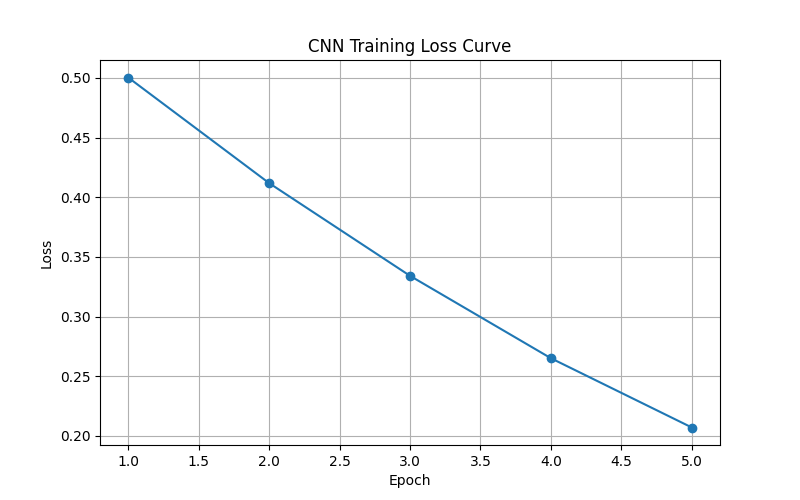
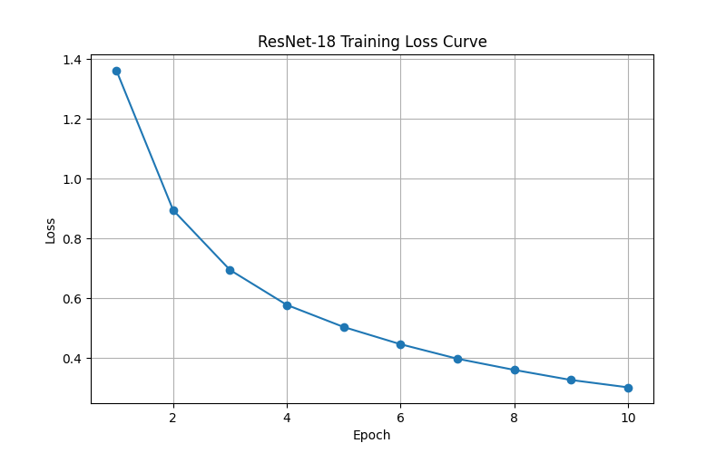
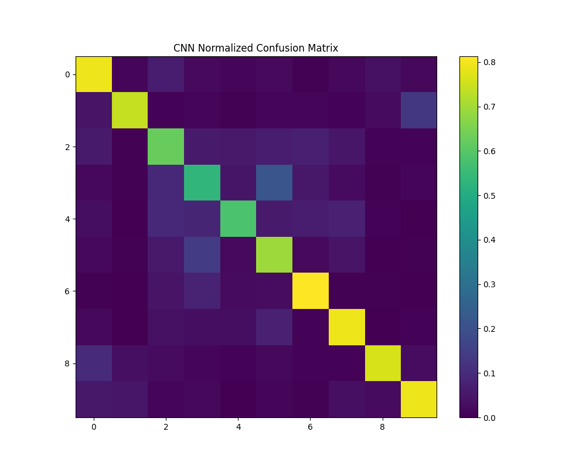
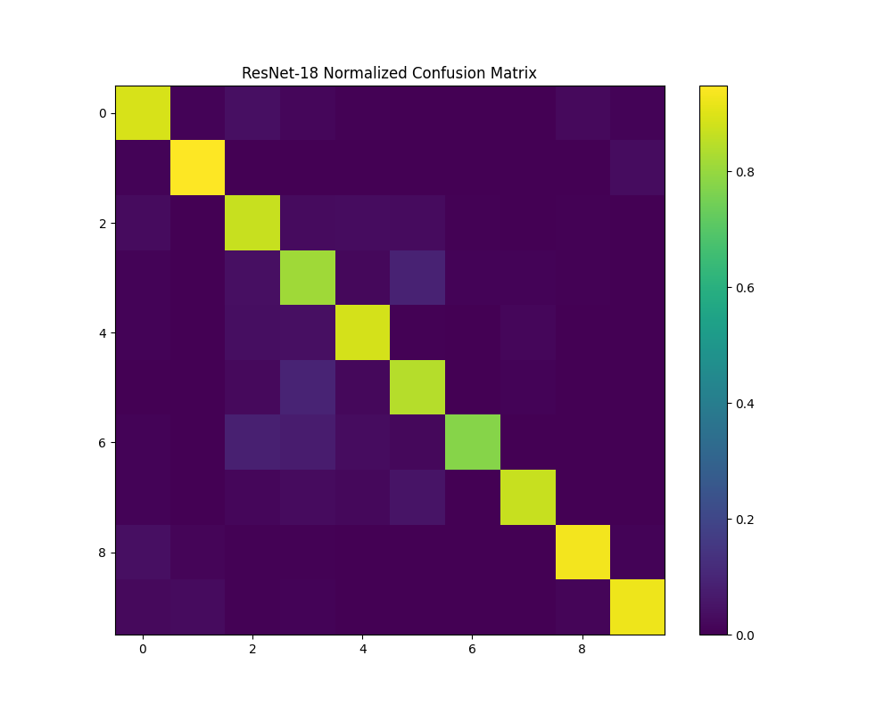
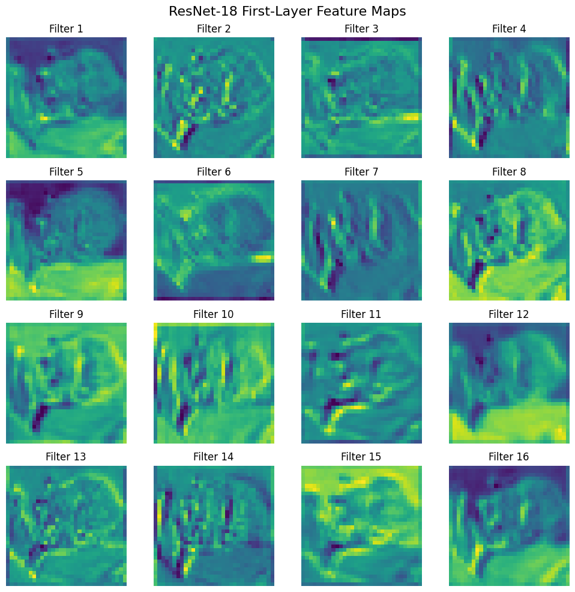
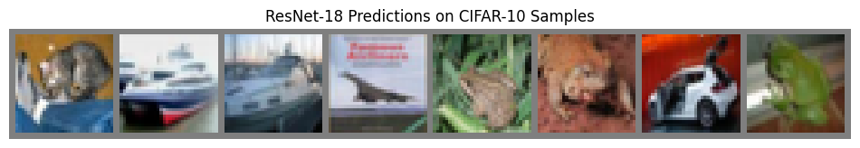

# CIFAR-10 Image Classification with CNN and ResNet18

**Author:** David Schechter  
**Project Type:** Computer Vision / Deep Learning  
**Dataset:** CIFAR-10  
**Framework:** PyTorch  

---

# Project Overview

This project builds and compares two deep learning architectures for image classification on the CIFAR-10 dataset:

• A **baseline Convolutional Neural Network (CNN)**  
• A **ResNet-18 architecture**

The goal is to explore how deeper residual architectures improve performance and training stability compared to standard CNNs.

The models were trained and evaluated using PyTorch with GPU acceleration.

---

# Dataset

**CIFAR-10**

- 60,000 images
- 10 classes
- Image size: 32×32
- 50,000 training images
- 10,000 test images

Classes:

```
airplane
automobile
bird
cat
deer
dog
frog
horse
ship
truck
```

---

# Model Architectures

## Baseline CNN

Architecture:

```
Input Image
   ↓
Conv Layer
   ↓
ReLU
   ↓
Max Pool
   ↓
Conv Layer
   ↓
ReLU
   ↓
Max Pool
   ↓
Fully Connected Layer
   ↓
Softmax
```

This model serves as a **baseline computer vision classifier**.

---

## ResNet-18

ResNet introduces **residual connections**, allowing deeper networks to train effectively.

Instead of learning:

```
H(x)
```

the network learns a residual:

```
F(x) = H(x) − x
```

which improves gradient flow during backpropagation.

Architecture overview:

```
Input Image
   ↓
Conv Layer
   ↓
Residual Block × 8
   ↓
Global Average Pooling
   ↓
Fully Connected Layer
   ↓
Softmax
```

---

# Training Setup

Framework: **PyTorch**

GPU: **NVIDIA Tesla T4**

Loss Function:

```
Cross Entropy Loss
```

Optimizer:

```
Adam
```

Training Pipeline:

```
Dataset
 → DataLoader
 → Model
 → Loss Function
 → Backpropagation
 → Optimizer Step
```

---

# Training Curves

## CNN Training Loss



## ResNet Training Loss



---

# Confusion Matrix

## CNN Confusion Matrix



## ResNet Confusion Matrix



---

# Feature Map Visualization

To better interpret what the network learned, I visualized first-layer feature maps from the trained ResNet-18 model.

These activations highlight low-level visual patterns such as:

- edges
- contrast boundaries
- texture-like structures
- simple shape detectors



# Example Model Predictions



These predictions highlight both correct classifications and failure cases.

Typical mistakes occur between visually similar classes:

```
cat ↔ dog
deer ↔ horse
automobile ↔ truck
```

This is expected due to the small resolution (32×32).

---

# Results

## Model Comparison

| Model | Test Accuracy | Notes |
|------|---------------:|------|
| Baseline CNN | 70.43% | 2-layer custom CNN baseline |
| ResNet-18 | 87.50% | Deeper residual architecture with stronger feature extraction |

**Improvement from CNN to ResNet-18:** **+17.07 percentage points**

ResNet-18 significantly outperformed the baseline CNN due to:

- deeper hierarchical feature learning
- residual connections improving gradient flow
- stronger representation capacity for complex visual patterns

Typical remaining errors occurred between visually similar classes such as:

- cat vs dog
- deer vs horse
- automobile vs truck

# Repository Structure

```
cifar10-resnet18-image-classifier
│
├── cnn_training_curve.png
├── resnet_training_curve.png
├── cnn_confusion_matrix.png
├── resnet_confusion_matrix.png
├── resnet_predictions.png
│
├── cnn_baseline_model.pth
├── resnet18_model.pth
│
├── cnn_training_losses.json
├── resnet_training_losses.json
├── resnet_per_class_accuracy.json
```

## ResNet-18 Per-Class Accuracy

| Class | Accuracy |
|------|---------:|
| airplane | 89.00% |
| automobile | 94.80% |
| bird | 87.00% |
| cat | 81.30% |
| deer | 88.80% |
| dog | 84.30% |
| frog | 77.60% |
| horse | 86.90% |
| ship | 93.00% |
| truck | 92.30% |

---

# Key Takeaways

• building a full deep learning training pipeline  
• training CNN and ResNet architectures  
• evaluating models with confusion matrices  
• visualizing training curves  
• analyzing classification errors  

---

# Future Improvements/Possible Extensions

• data augmentation  
• deeper ResNet variants  
• transfer learning from ImageNet  
• attention mechanisms  
• feature map visualization

---

# Author

**David Schechter**

Incoming MIT '30  
Interested in AI, Machine Learning, and Computer Vision
